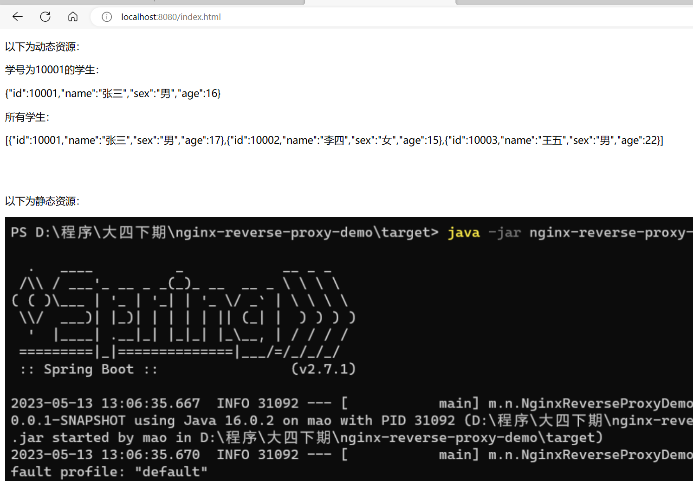
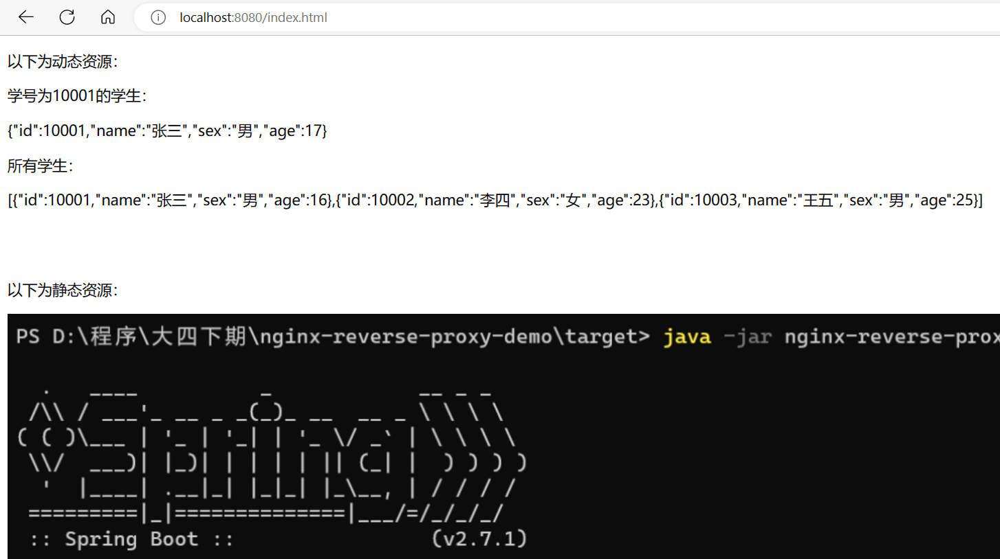
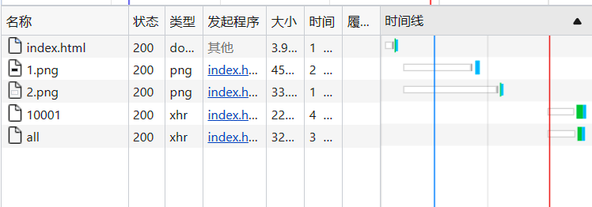
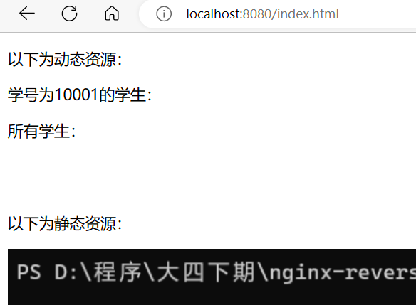
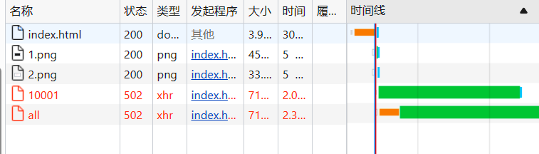

# Nginx实现动静分离

## 概述

动：指的是动态资源，后台应用程序的业务处理

静：网站的静态资源(html,javaScript,css,images等文件)


什么是动静分离？

动静分离是将两者进行分开部署访问，提供用户进行访问。举例说明就是以后所有和静态资源相关的内容都交给Nginx来部署访问，非静态内容则交个类似于Tomcat的服务器来部署访问


Nginx在处理静态资源的时候，效率是非常高的，而且Nginx的并发访问量也是名列前茅，而Tomcat则相对比较弱一些，所以把静态资源交个Nginx后，可以减轻Tomcat服务器的访问压力并提高静态资源的访问速度

动静分离以后，降低了动态资源和静态资源的耦合度。如动态资源宕机了也不影响静态资源的展示

实现动静分离的方式很多，比如静态资源可以部署到CDN、Nginx等服务器上，动态资源可以部署到Tomcat,weblogic或者websphere上


## 实现

创建一个spring boot程序，端口为9888

controller内容如下：

```java
package mao.nginx_dynamic_and_static_separation_demo.controller;

import org.slf4j.Logger;
import org.slf4j.LoggerFactory;
import org.springframework.web.bind.annotation.*;

import java.util.ArrayList;
import java.util.List;
import java.util.StringJoiner;

/**
 * Project name(项目名称)：nginx_dynamic_and_static_separation_demo
 * Package(包名): mao.nginx_dynamic_and_static_separation_demo.controller
 * Class(类名): TestController
 * Author(作者）: mao
 * Author QQ：1296193245
 * GitHub：https://github.com/maomao124/
 * Date(创建日期)： 2023/5/19
 * Time(创建时间)： 13:22
 * Version(版本): 1.0
 * Description(描述)： 无
 */

@RestController
@RequestMapping("/student")
public class TestController
{
    private static final Logger log = LoggerFactory.getLogger(TestController.class);


    public static int getIntRandom(int min, int max)
    {
        if (min > max)
        {
            min = max;
        }
        return min + (int) (Math.random() * (max - min + 1));
    }


    /**
     * 通过id得到学生信息
     *
     * @param id id
     * @return {@link Student}
     */
    @GetMapping("/{id}")
    public Student getById(@PathVariable Long id)
    {
        Student student = new Student();
        student.id = id;
        student.name = "张三";
        student.sex = "男";
        student.age = getIntRandom(15, 25);
        log.info(student.toString());
        return student;
    }


    /**
     * 得到所有学生信息
     *
     * @return {@link List}<{@link Student}>
     */
    @GetMapping("/all")
    public List<Student> getAll()
    {
        List<Student> studentList = new ArrayList<>(3);
        Student student = new Student();
        student.id = 10001L;
        student.name = "张三";
        student.sex = "男";
        student.age = getIntRandom(15, 25);
        studentList.add(student);
        student = new Student();
        student.id = 10002L;
        student.name = "李四";
        student.sex = "女";
        student.age = getIntRandom(15, 25);
        studentList.add(student);
        student = new Student();
        student.id = 10003L;
        student.name = "王五";
        student.sex = "男";
        student.age = getIntRandom(15, 25);
        studentList.add(student);
        log.info(studentList.toString());
        return studentList;
    }

    /**
     * 学生实体类
     *
     * @author mao
     * @date 2023/05/19
     */
    public static class Student
    {
        public Long id;
        public String name;
        public String sex;
        public Integer age;

        public Long getId()
        {
            return id;
        }

        public String getName()
        {
            return name;
        }

        public String getSex()
        {
            return sex;
        }

        public Integer getAge()
        {
            return age;
        }

        @Override
        public String toString()
        {
            return new StringJoiner(", ", Student.class.getSimpleName() + "[", "]")
                    .add("id=" + id)
                    .add("name='" + name + "'")
                    .add("sex='" + sex + "'")
                    .add("age=" + age)
                    .toString();
        }
    }
}

```


启动程序


准备两张图片1.png和2.png，放入nginx安装目录的static目录

```sh
PS D:\opensoft\nginx-1.24.0> ls


    目录: D:\opensoft\nginx-1.24.0


Mode                 LastWriteTime         Length Name
----                 -------------         ------ ----
d-----         2023/5/17     14:24                cache
d-----         2023/5/12     14:54                conf
d-----         2023/4/11     23:31                contrib
d-----         2023/4/11     23:31                docs
d-----         2023/5/18     14:11                file
d-----          2023/5/3     14:45                html
d-----         2023/5/12     14:54                key
d-----         2023/5/18     14:16                logs
d-----         2023/5/19     13:58                static
d-----         2023/4/29     13:29                temp
-a----         2023/4/11     23:29        3811328 nginx.exe


PS D:\opensoft\nginx-1.24.0> cd .\static\
PS D:\opensoft\nginx-1.24.0\static> ls


    目录: D:\opensoft\nginx-1.24.0\static


Mode                 LastWriteTime         Length Name
----                 -------------         ------ ----
-a----         2023/5/13     13:07         449442 1.png
-a----         2023/5/18     14:35          32901 2.png


PS D:\opensoft\nginx-1.24.0\static>
```


更改html目录下的index.html页面

```html
<!DOCTYPE html>

<!--
Project name(项目名称)：nginx_dynamic_and_static_separation_demo
  File name(文件名): index
  Authors(作者）: mao
  Author QQ：1296193245
  GitHub：https://github.com/maomao124/
  Date(创建日期)： 2023/5/19
  Time(创建时间)： 13:33
  Description(描述)： 无
-->

<html lang="en">
<head>
    <meta charset="UTF-8">
    <title>索引</title>
</head>
<body onload="load()">

<p>以下为动态资源：</p>


<p>学号为10001的学生：</p>
<p id="student"></p>

<p>所有学生：</p>
<p id="studentList"></p>


<br>
<br>

<p>以下为静态资源：</p>


<br>


</body>

<script>

    function load()
    {
        //XMLHttpRequest对象
        let xhr;
        //是否正在发送请求
        let isSending = false;
        //如果正在发送请求
        if (isSending === true)
        {
            //取消正在发送的请求
            xhr.abort();
        }
        //发起异步请求
        xhr = new XMLHttpRequest();
        //设置响应信息为json
        xhr.responseType = "json";
        //超时设置，单位为毫秒
        xhr.timeout = 5000;
        //超时的回调函数
        xhr.ontimeout = function ()
        {
            alert("请求超时，请稍后再试！");
        }
        //初始化，设置请求方式和url
        xhr.open("GET", "/student/10001");
        //设置状态为正在发送
        isSending = true;
        //发送异步请求
        xhr.send();

        xhr.onreadystatechange = function ()
        {
            //状态为4时处理
            if (xhr.readyState === 4)
            {
                //落在200-300之间处理
                if (xhr.status >= 200 && xhr.status < 300)
                {
                    //将状态设置成false
                    isSending = false;
                    console.log(xhr.response);
                    document.getElementById("student").innerHTML = JSON.stringify(xhr.response);
                }
            }
        }
        load2();
    }

    function load2()
    {
        //XMLHttpRequest对象
        let xhr;
        //是否正在发送请求
        let isSending = false;
        //如果正在发送请求
        if (isSending === true)
        {
            //取消正在发送的请求
            xhr.abort();
        }
        //发起异步请求
        xhr = new XMLHttpRequest();
        //设置响应信息为json
        xhr.responseType = "json";
        //超时设置，单位为毫秒
        xhr.timeout = 5000;
        //超时的回调函数
        xhr.ontimeout = function ()
        {
            alert("请求超时，请稍后再试！");
        }
        //初始化，设置请求方式和url
        xhr.open("GET", "/student/all");
        //设置状态为正在发送
        isSending = true;
        //发送异步请求
        xhr.send();

        xhr.onreadystatechange = function ()
        {
            //状态为4时处理
            if (xhr.readyState === 4)
            {
                //落在200-300之间处理
                if (xhr.status >= 200 && xhr.status < 300)
                {
                    //将状态设置成false
                    isSending = false;
                    console.log(xhr.response);
                    document.getElementById("studentList").innerHTML = JSON.stringify(xhr.response);
                }
            }
        }
    }

</script>

</html>
```


修改nginx配置文件

```sh
#配置运行Nginx进程生成的worker进程数
worker_processes 2;
#配置Nginx服务器运行对错误日志存放的路径
error_log ./logs/error.log;
#配置Nginx服务器允许时记录Nginx的master进程的PID文件路径和名称
pid ./logs/nginx.pid;
#配置Nginx服务是否以守护进程方法启动
#daemon on;


events{
	#设置Nginx网络连接序列化
	accept_mutex on;
	#设置Nginx的worker进程是否可以同时接收多个请求
	multi_accept on;
	#设置Nginx的worker进程最大的连接数
	worker_connections 1024;
	#设置Nginx使用的事件驱动模型
	#use epoll;
}


http{
	#定义MIME-Type
	include mime.types;
	default_type application/octet-stream;
     

upstream studentserver
{
  server 127.0.0.1:9888;
}

server {
        listen          8080;
        server_name     localhost;

          location /static{
            alias static;
         }

         location ~/.*\.(html|css|js){
                root html;
        }
           location /{
            proxy_pass http://studentserver;
         }
   }
}
```


检查并启动：

```sh
PS D:\opensoft\nginx-1.24.0> ./nginx -t
nginx: the configuration file D:\opensoft\nginx-1.24.0/conf/nginx.conf syntax is ok
nginx: configuration file D:\opensoft\nginx-1.24.0/conf/nginx.conf test is successful
PS D:\opensoft\nginx-1.24.0> start ./nginx
PS D:\opensoft\nginx-1.24.0>
```


访问

http://localhost:8080/index.html











都能正常访问

关闭后端服务，再次访问







无法获取到动态资源，但是静态资源依旧能获取


